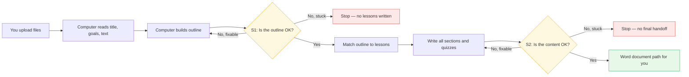
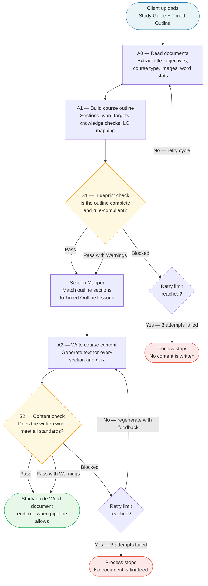
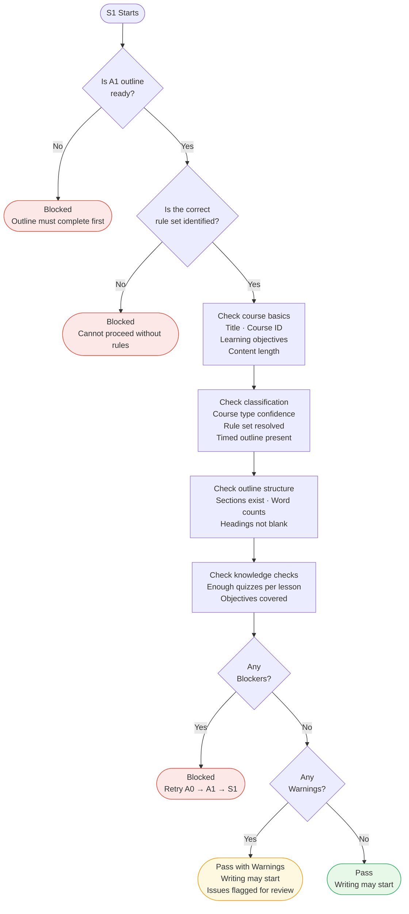
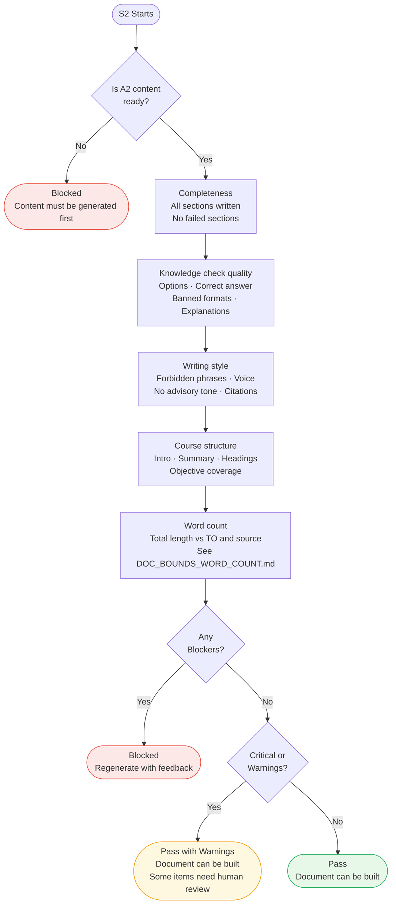
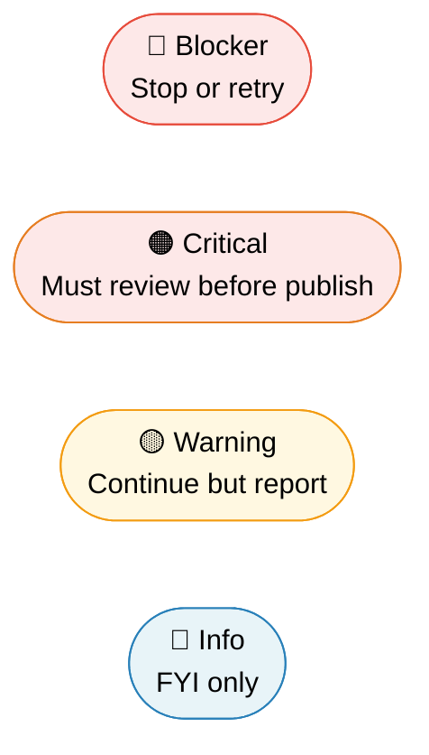

# Quality Checks — S1 and S2 (Plain English + Technical Detail)

This page explains the **two automatic quality checks** in the course-building pipeline. Start with **Section 1** if you are not technical; use **Section 5–6** if you read JSON reports or support integrations.

---

## 1. Plain English — what problem do these solve?

Think of building a course like building a house:

- **S1** checks the **blueprint** before anyone pours concrete. If the plan is wrong or incomplete, writing hundreds of pages would waste time.
- **S2** checks the **built house** before handing keys to the client. If the walls are wrong, you fix them before move-in.

So:

| Question | S1 answers… | S2 answers… |
|----------|-------------|-------------|
| When? | After the **outline** exists, **before** the AI writes lesson text | After **all content** is generated, **before** the final Word file is finalized |
| Main goal | Is the **plan** complete (sections, counts, rules, quizzes on paper)? | Is the **actual text** OK (length, style, quizzes, structure)? |
| If something is badly wrong? | The system can **rebuild the outline** (retries) | The system can **regenerate content** (retries) |
| If it finally cannot pass? | The run **stops** before writing | The run **stops** before a “finished” document is delivered |

**Nothing is “optional” in the sense of skipping quality** — the pipeline is designed so a bad plan or bad content does not silently become a client deliverable.

---

## 2. One-picture story (non-technical)



---

## 3. How the full pipeline fits together (with stage names)

The course is built in order. S1 and S2 are **gates** — the next stage should not act as if everything is fine when a gate says “blocked.”



---

## 4. S1 — Blueprint check (outline stage)

S1 runs **before** any lesson body is generated. It protects you from generating content on top of a broken structure.

### What S1 checks — flowchart



### What S1 looks for (summary)

**Course basics (from the source document)**  
Title, course ID, learning objectives, and that enough text was read for classification.

**Classification**  
The system should know what *type* of course this is (for example insurance CE) and load the right **rule pack** (compliance rules for that type).

**Outline structure**  
Real sections, sensible word targets, no blank headings.

**Knowledge checks (on the plan)**  
Enough planned quizzes and coverage of each learning objective (per rule pack).

### S1 outcomes

| Result | Meaning | What happens next |
|--------|---------|-------------------|
| Pass | Plan looks good | Content generation can run |
| Pass with Warnings | Non-fatal issues | Generation can run; issues need review |
| Blocked | Fatal issue | Outline path is retried; if still blocked after retries, the run stops |

---

## 5. S2 — Content check (after writing)

S2 runs **after** A2 has produced sections and quizzes. It checks the **real text**, not just the outline.

### What S2 checks — flowchart



**Word count details** (source vs Timed Outline, 50%–80% band vs direct TO) live in:

`s2_validator/utils/DOC_BOUNDS_WORD_COUNT.md`

### S2 outcomes

| Result | Meaning | What happens next |
|--------|---------|-------------------|
| Pass | Content passes automated rules | Final `.docx` can be produced (when the pipeline step runs) |
| Pass with Warnings | Issues that should be reviewed | Document may still build; humans should review flagged items |
| Blocked | Must fix or regenerate | Content step retries with feedback; if stuck, no safe handoff |

---

## 6. Severity levels (same idea in S1 and S2)



| Level | Plain meaning |
|-------|----------------|
| 🔴 Blocker | Pipeline should not pretend success; fix or retry |
| 🟠 Critical | Serious; human review required before publishing |
| 🟡 Warning | Worth fixing when convenient |
| 🔵 Info | Heads-up only |

---

## 7. Sample outputs (semi-technical)

Reports are saved as JSON next to the run (names like `s1_validation.json`, `s2_validation.json` under the run’s shared state folder). Each **issue** usually looks like this:

```json
{
  "field": "knowledge_check.options_count",
  "expected": "4 options (A–D)",
  "found": 2,
  "severity": "blocker",
  "message": "Question has only 2 options; rule requires four.",
  "rule_source": "kc_format_rules.min_options",
  "failure_reason": "Rule pack requires four labeled choices for each knowledge check.",
  "remediation": "Regenerate the affected section or edit options to add B–D."
}
```

**S1 report (tiny excerpt)** — shows overall status plus issues:

```json
{
  "status": "pass_with_warnings",
  "issues": [
    {
      "field": "learning_objectives.count",
      "severity": "warning",
      "message": "LO count is at lower bound of configured range.",
      "rule_source": "content_rules.learning_objectives_range"
    }
  ]
}
```

**S2 report (tiny excerpt)** — often includes many checks; word-count issues reference `doc_bounds.*` or `error_tolerance.word_count_tolerance_percent`:

```json
{
  "status": "blocked",
  "issues": [
    {
      "field": "a2_output.stats.total_words",
      "severity": "blocker",
      "rule_source": "doc_bounds.bounds_path_over_to",
      "message": "A2 generated 10500 words — above TO (10000) on bounds path."
    }
  ]
}
```

Exact field names depend on the failing check; see the `rule_source` string to trace back to the Python check in `s1_validator/utils/checks.py` or `s2_validator/utils/`.

---

## 8. Validation reports (what gets saved)

After each check, the system stores:

- **What was checked** (field path)
- **What was expected**
- **What was found**
- **Severity**
- **Why it matters** (`failure_reason`) and **what to do** (`remediation`) when present

Use these for audits, client questions, and debugging.

---

## 9. Summary

- **S1** protects the **outline** before expensive writing.  
- **S2** protects the **finished text** before delivery.  
- **Word count** for generated length is explained separately in `DOC_BOUNDS_WORD_COUNT.md`.  
- **Sample JSON** above matches the spirit of real reports; your run may include more fields from the Pydantic models in `pipeline/models/validation.py`.
